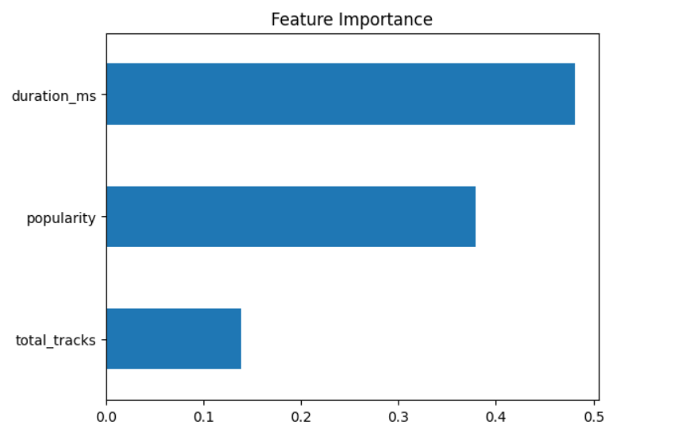
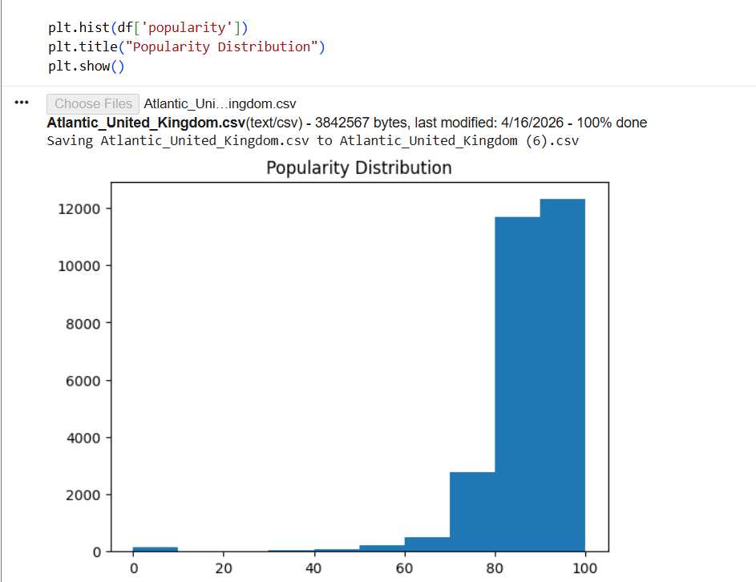

# UK Top 50 Music Analysis using Machine Learning

## Objective
To analyze UK music charts and predict hit songs using ML.

## Dataset
Contains 1000+ songs with features like popularity, position, duration.

## Model
Random Forest Classifier

## Results
Achieved ~90% accuracy in predicting hit songs.

## Key Insights
- Popularity strongly affects song success
- Global artists dominate UK charts
- Chart competition is high

## Tools Used
- Python
- Pandas
- Scikit-learn
- Google Colab

## 📊 Visualizations

### Feature Importance

### Popularity Distribution

